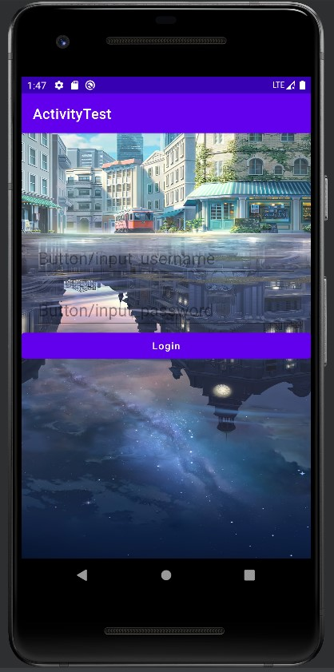
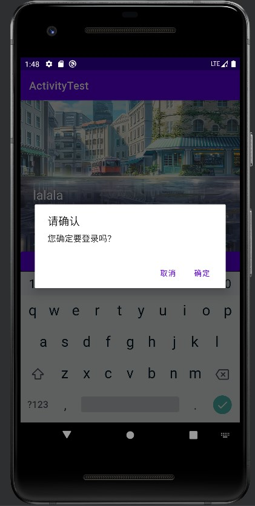
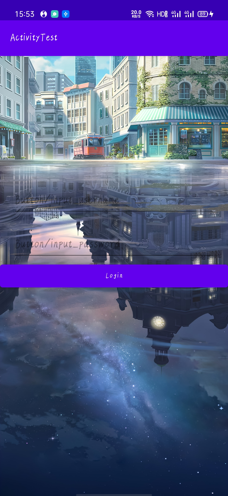
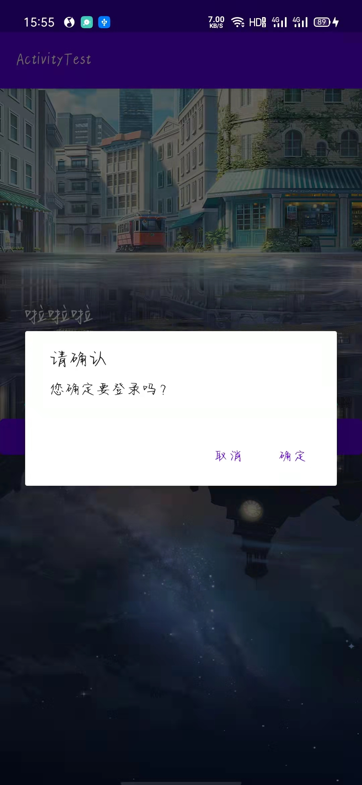
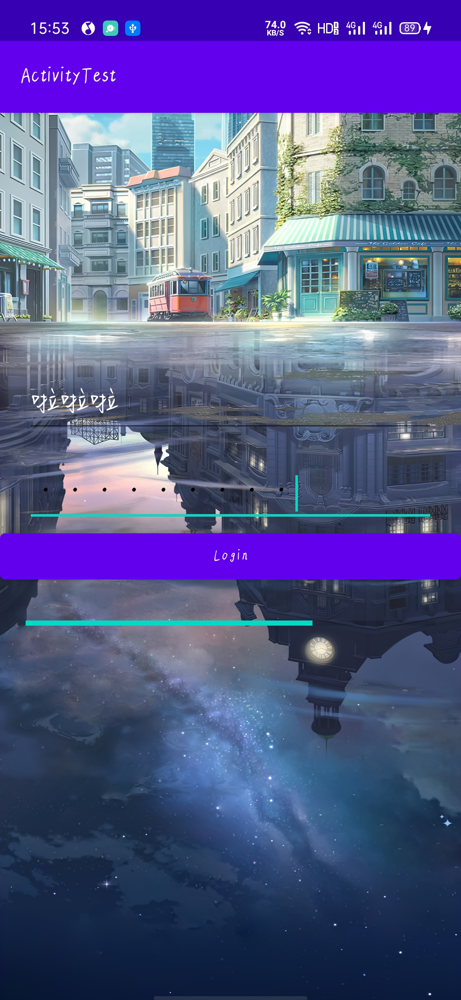
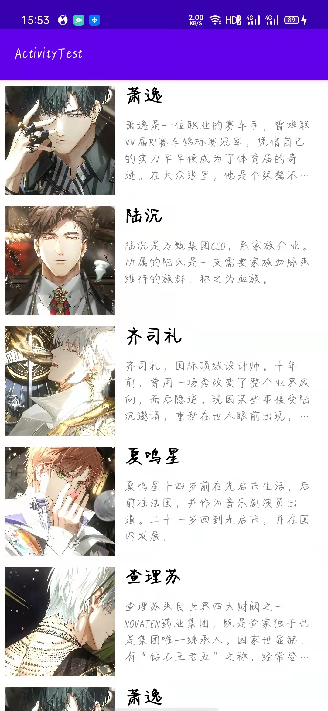

# Android-Studio_ActivityTest
- 使用 EditText , TextView, Button ,ImageView ,ProgressBar, AlertDialog 等基础组件- 使用 RecyclerView 完成一个列表视图
（1）TestView：修改在activity_main.xml中的代码，用“hello world！”为例子，来查看设置不同书写文字的显示位置，以及文字本身的属性，代码为activity_main.xml中的<TextView/>中的；
（2）Button：在activity_main.xml中添加按钮，实现登录点击跳转；
（3）EditText：在修改activity_main.xml中添加代码从而个添加一个EditText控件，让程序和用户进行交互，允许用户在控件里输入和编辑内容，并可以在程序中对这些内容进行处理；
（4）ProgessBar：在activity_main中的写代码，添加一个ProgessBar,用于在界面上显示一个进度条，表示我们正在加载一些数据；
（5）AlertDialog：在activity_main中的写代码，AlertDialog可以在当前界面弹出一个对话框，这个对话框是位于所有界面元素之上的，能够屏蔽其他控件的交互能力；
（6）完成APP页面简单的排列，显示信息。

截图：
（1）虚拟机：

![Image](image-readme/xnj3.jpg

（2）真机：

